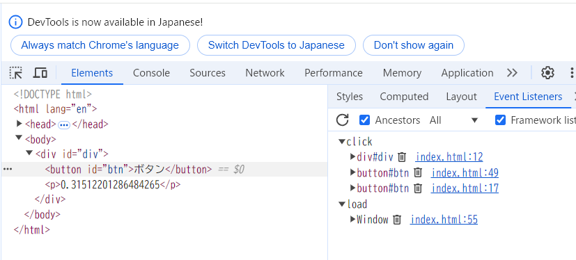
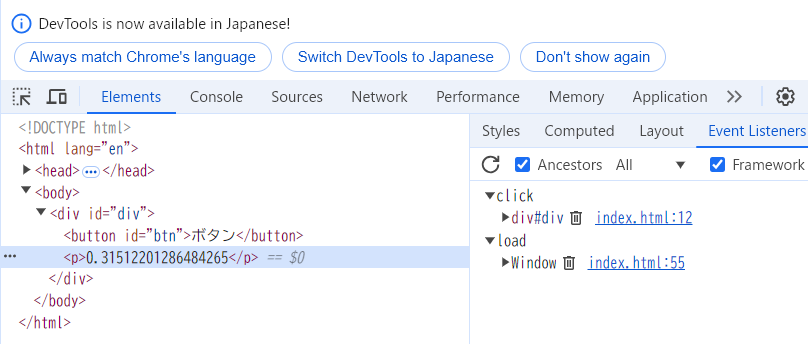

以下の html を開き、ボタン押下時のコンソール出力結果を確認しなさい。
次に capture の値を変更し div と button のコンソール出力順序が逆になることを確認しなさい。
更に script 中のコメント 1.～ 4.の指示に従いカスタムイベントの関連コードを完成させなさい。
最後にブラウザのデバッグツール(Chrome の場合は Developer Tool の Event Listners)で、btn 等に登録されているイベントをそれぞれ確認しなさい。

# 動作確認

div→button の順で console.log に出力される

# capture の値を変更：true から false に変更

button→div の順で console.log に出力される

# イベント確認

btn：

p：

