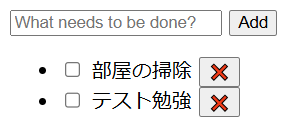
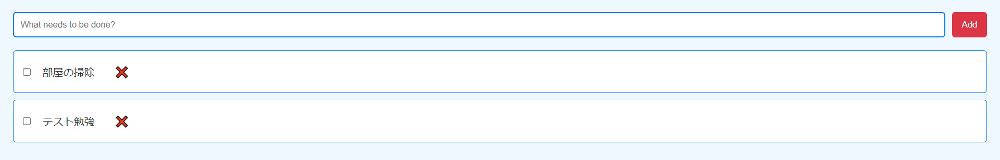
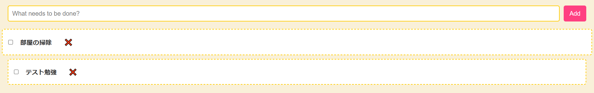
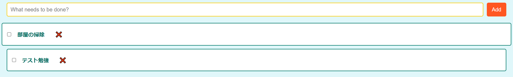

CSS の力を体感してみよう。CSS 自体の学習はそれだけで 1 冊の本になってしまうため、この問題では ChatGPT を使って CSS を生成する (JavaScript に関してはこれまで通り出来る限り生成 AI を使わずに解答しなさい)。
ex01 は問題 15.1-3.1 を少し改良した ToDo アプリである。

このアプリの見た目を変更する CSS を ChatGPT で生成させて style.css を置き換えなさい。
1 で作成した CSS が何をしているか調査し、以下の例を参考に各セレクタ単位で最低 1 行のコメントを書きなさい。
調査の際はブラウザの開発者ツール (問題 15.4-10.3 参照) を使い、各 CSS をオン・オフするとどうなるか確認すると良い。

/_ 幅 600px で影と丸みを付けて中央に配置 _/
main {
max-width: 600px;
margin: 50px auto;
padding: 20px;
background-color: #ffffff;
border-radius: 10px;
box-shadow: 0 0 10px rgba(0, 0, 0, 0.1);
}

ヒント: ChatGPT のプロンプトの例は以下 (各自「ポケモンのピカチュウ風のデザインにして」など工夫してみなさい):

以下の HTML, JavaScript および CSS は ToDo アプリのソースコードです。CSS を変更して見栄えを良くしてください。

```html
{ここに index.html の内容を貼り付ける}
```

```js
{ここに index.js の内容を貼り付ける}
```

```css
{ここに style.css の内容を貼り付ける}
```

参考: プロンプトのテクニックについてより深く学びたい場合は Prompt engineering を参照。
https://platform.openai.com/docs/guides/prompt-engineering/tactic-use-delimiters-to-clearly-indicate-distinct-parts-of-the-input
出題範囲: 15.4

# やってみたこと

- デフォルト  
  

- 青と赤を基調にしたデザインにしてください  
  
  bluered.css 参照

  > 背景色は薄い青に設定しました。
  > フォームやボタンは青と赤のコントラストを持たせ、ホバー時の色変化も加えました。
  > ToDo リストの項目は青色の枠で囲み、背景は白にして見やすくしました。
  > 完了したタスクはグレーで表示され、視覚的に区別しやすくしています。

- ディズニー風のデザインにしてください  
    
  disney.css 参照

  > フォントを「Comic Sans MS」に変更して、カジュアルで楽しい雰囲気を出しました。
  > 背景色を明るいクリーム色にし、ディズニーの明るいイメージを反映しました。
  > ボタンはピンク系の色にし、ホバー時に色が変わるように設定しました。
  > ToDo リストのアイテムはダッシュラインで囲み、ホバー時に拡大する効果を追加しました。
  > 完了したタスクはグレーで視覚的に区別しています。

- ONE PIECE 風のデザインにしてください  
  
  > 背景色を明るい水色に設定して、海をイメージしました。
  > フォームとボタンには、海賊をイメージした色を使用しました。
  > ToDo リストのアイテムには深い青の枠を付け、ホバー時に拡大する効果を追加しました。
  > 完了したタスクはグレーで視覚的に区別しています。
