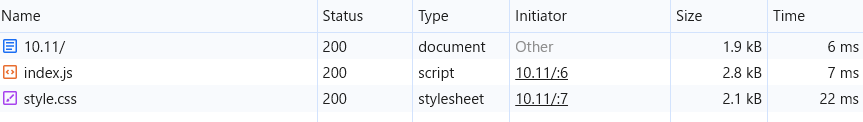
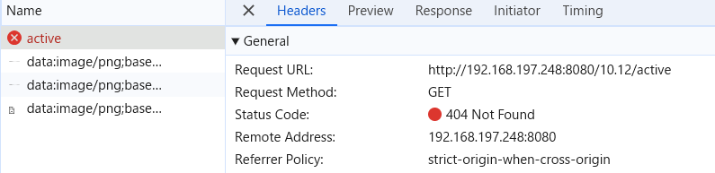

15.4-10.11 は hashchange を利用した。もし以下のように pushState を利用した実装にした場合どうなるだろうか？ 途中までの実装を ex12 に用意した。

<footer>
  <li><a id="all">All</a></li>
  <li><a id="active">Active</a></li>
  <li><a id="completed">Completed</a></li>
</footer>

document.querySelector("#active").addEventListener("click", (e) => {
e.preventDefault();
window.history.pushState(null, "", "/ch15.04-10/ex12/active");
renderTodos(/_ TODO: ここは自分で考えてみて下さい (ex11 の答えに近いので) _/);
});

Active や Completed を選択後にブラウザのリロードを行うとどうなるだろうか。hashchange と pushState それぞれの実装について調べなさい
(ヒント: 開発者ツールでどのような通信が発生しているか調べてみなさい)。
ここまでの例は serve コマンドで HTML や JS といったファイル配信するサーバーを立ち上げてきた。
サーバー側がどのような挙動をすれば pushState を使った実装が期待通り動作するか考えて答えなさい。
https://www.npmjs.com/package/serve

出題範囲: 15.10

# リロードを行うと… hashchange の場合

http://192.168.197.248:8080/10.11/#/active  
↑URL は上記のままで、データは消えた  
開発者ツールで確認しても何も起こっていないように見える  
(画像は初回の読み込みの時)

# リロードを行うと… pushState の場合

http://192.168.197.248:8080/10.12/active  
↑URL は上記のままで、「ページが見つかりません」が表示された  
↑ の URL に対して「GET」を実行されている

# どうしたら期待通り動作するか

~~get メソッドでデータを取得するようにする~~

GET で 404(=ページが取得できていない)ので、取得できるようにする
