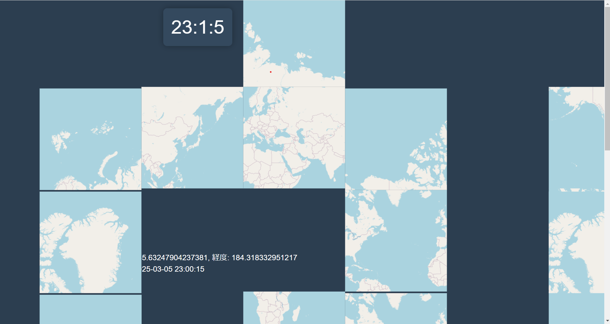

# 概要

会心のデジタル時計の作成をお願いします。 最終課題は、以下の点を満たしていれば何でもよいです。

- JavaScript または TypeScript で書かれていること
- 時計が何らかの形で、最終的には表示されること

時計のデモで、何らかの特別な機材が必要な場合には、各人で持ってきてください。

# 仕様

- デフォルトでは日本の標準時を表示
- 画面上部に世界地図が表示されており、クリックするとその場所の何か(地名か緯度経度など)とその地点の現在時刻を表示する
- 地図については拡大縮小できる
- 地図は中央に 1 つ
- お金はかけない

# メモ

### 日本標準時のデジタル時計を表示する

JavaScript でデフォルトで日本標準時（JST）を表示するために、Date オブジェクトを使って現在時刻を取得し、setInterval で定期的に更新

### 世界地図の表示

Leaflet.js を使って世界地図を表示。地図上でクリックすると、クリックした場所の緯度経度を取得し、その場所の現在時刻を取得して表示。  
https://leafletjs.com/  
(Leaflet.js は以前、自己学習として触ってみたことがある)  
デフォルトでは拡大倍率 5 で設定。

### クリックした場所の時刻を取得する

クリックした地点の緯度(latitude)と経度(longitude)を取得し、その情報をもとにタイムゾーンを取得する：ここは Google Maps Time Zone Api を使う
https://developers.google.com/maps/documentation/timezone/get-started?hl=ja  
→ 自分で少し使うくらいであれば無料で済みそう

### クリックした地点の緯度経度、現在時刻をリアルタイムで表示する

↑ で取得した情報を最後にまとめて表示。時刻は取得した時点ではなく、時刻が進んでいること。

# 課題

### なぜか地図が大量に表示される

地図が複数回レンダリングされていた様子

### 一瞬表示される undefined

最後の表示のところで、緯度/経度が一瞬 undefined で表示された  
ソースコード見直すと、なぜか時刻更新の関数に緯度経度を渡しており、無駄だったのでやめたところうまく表示されるように

### 増殖するマーカー

地点を選択するたびに増えるマーカー  
マーカーを削除する処理がなかったので増える一方だった

# 参考

https://qiita.com/taizo/items/3a5505308ca2e303c099  
https://zenn.dev/akkie1030/articles/javascript-dayjs  
https://qiita.com/TakeshiNickOsanai/items/783caa9f31bcf762da16  
https://ktgis.net/service/leafletlearn/advanced.html  
https://qiita.com/poruruba/items/ffdf8e29a147c272f142  
https://qiita.com/kottaro123456/items/6427a0d94459048b6bd1  
https://noauto-nolife.com/post/leaflet-marker-delete/
